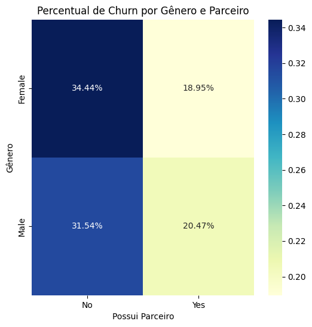

# Análise de Cancelamento de Clientes

  

## 📌 Visão Geral
Este projeto tem como objetivo analisar de forma exploratória e descritiva os dados de churn de uma empresa de Telecom, identificando padrões de cancelamento de serviço e características dos clientes que podem influenciar essa decisão.
Para isso, foram utilizadas técnicas de Análise Exploratória de Dados (EDA) com Python, empregando bibliotecas como Pandas, Seaborn e Matplotlib. O resultado esperado é compreender o perfil dos clientes, hábitos de consumo e fatores que impactam no churn, auxiliando na tomada de decisão estratégica para retenção de clientes.

## 📂 Fonte dos Dados
Todos os dados utilizados neste projeto foram obtidos a partir do dataset “Telco Customer Churn”, disponibilizado publicamente no [Kaggle](https://www.kaggle.com/datasets/blastchar/telco-customer-churn).

O Telco Customer Churn é um conjunto de dados fictício criado para fins educacionais e de prática de análise de dados, comumente utilizado em estudos de Análise Exploratória de Dados (EDA), visualização e modelagem preditiva de churn.

O dataset simula informações reais de uma operadora de telecomunicações, incluindo variáveis como perfil demográfico, serviços contratados, gastos mensais, tempo de permanência e o status de churn (cancelamento ou não do serviço).

## 📊 Destaques do Projeto

### Mapa de Calor — Impacto de Gênero e Parceria no Churn”
O principal destaque deste projeto é o **mapa de calor (heatmap)** que cruza gênero e status de parceria com o percentual de churn.  
Essa análise cruzada revela padrões valiosos que **não seriam visíveis em métricas isoladas**, mostrando como fatores combinados influenciam o cancelamento de clientes.

  

